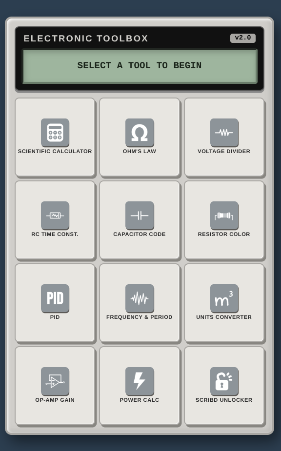

<div align="center">

# ToolE


[](LICENSE) [](https://opensource.org/) [](https://amblackpearl.github.io/ToolE/) [](https://github.com/amblackpearl/ToolE/stargazers) [](https://github.com/amblackpearl/ToolE/network) [](https://github.com/amblackpearl/ToolE/issues)


</div>

<p align="center">
  <a href="#what-it-does">What it does</a> ·
  <a href="#highlights">Highlights</a> ·
  <a href="#module-market">Module Market</a> ·
  <a href="#feature-catalog">Feature catalog</a> ·
  <a href="#tech-stack">Tech stack</a> ·
  <a href="#build">Build</a> ·
  <a href="#contributing">Contributing</a>
</p>

---

<div align="center">



</div>


---

## What it does
**ToolE (Toolbox Electronics)** is a comprehensive, web-based suite of electronics and engineering tools wrapped in a single, sleek, and highly responsive interface. Modeled after the aesthetics of physical electronic devices (like a multimeter or a scientific calculator), ToolE provides engineers, students, and hobbyists with a centralized dashboard to perform complex calculations, decode component values, and solve mathematical expressions instantly without relying on server-side processing.


## Highlights
- **Sleek Device-like Interface:** Features a realistic UI with a simulated LCD screen, tactile keys, and a rugged chassis design.
- **Zero-Latency Calculations:** All computations run locally in the browser, ensuring instant feedback and offline capability.
- **Advanced Mathematical Engine:** Powered by robust libraries to handle advanced algebra, trigonometry, calculus, and matrix operations.
- **Interactive Visualizers:** Includes dynamic visual aids, such as a clickable 4-band resistor color code decoder.
- **Responsive Design:** Optimized for both desktop and mobile viewing with a mobile-first Single Page Application (SPA) approach.

## Module Market
ToolE comes pre-equipped with a rich collection of standalone modules accessible from the main dashboard:
1. **Scientific Calculator:** Advanced algebra, trig, calculus, and matrix operations.
2. **Ohm's Law:** Quick V = I × R calculations.
3. **Voltage Divider:** Vout calculator given Vin, R1, and R2.
4. **RC Time Constant:** Calculate τ = R × C and percentage charge over time.
5. **Capacitor Code:** 3-Digit decoder translating codes to pF, nF, and µF.
6. **Resistor Color Code:** Interactive 4-Band decoder with tolerance visualization.
7. **PID Calculator:** Ziegler-Nichols tuning (P, PI, PID, Pessen) based on Ku and Pu.
8. **Frequency & Period:** Conversion between frequency, period, and wavelength.
9. **Units Converter:** Specialized electrical units converter (pico, nano, micro, milli, kilo, mega, giga).
10. **Op-Amp Gain:** Inverting and Non-Inverting operational amplifier gain calculations.
11. **Power Calc:** Calculate power using P=VI, P=I²R, or P=V²/R.
12. **Scribd Unlocker:** Bonus utility to bypass standard document viewing restrictions.

## Feature Catalog
- **Real-Time Math Parsing:** Type or tap complex equations and receive real-time updates.
- **Dynamic Matrix Operations:** Dedicated modals for inserting matrices, calculating Determinants, Inverses, and Transposes.
- **Calculus & Algebra Support:** Integrals, limits, derivatives, factorials, logarithms, and combinatorial math.
- **Engineering Formatting:** Outputs are automatically formatted to standard engineering notation (e.g., m, µ, n, p, k, M, G).
- **Interactive State Management:** Easily swap between different calculation formulas (e.g., in the Power Calculator) with dynamic input updates.
- **Toast Notifications:** Non-intrusive alerts for invalid inputs or calculation errors.

## Tech Stack
ToolE is built using lightweight, modern web technologies without the overhead of heavy frameworks:
- **Core:** HTML5, CSS3, Vanilla JavaScript
- **Math Engines:** 
  - [Nerdamer](https://nerdamer.com/) (Core, Algebra, Calculus, Solve)
  - [Math.js](https://mathjs.org/)
- **Math Rendering & Input:** 
  - [MathLive](https://cortexjs.io/mathlive/) (Interactive math keyboard/input)
  - [KaTeX](https://katex.org/) (High-performance math typesetting)
- **Styling & Assets:** 
  - FontAwesome 6 (Icons)
  - Google Fonts (VT323, IBM Plex Mono) for realistic LCD styling.

## Build
Because ToolE is built entirely with Vanilla HTML, CSS, and JavaScript, **there is no complex build step required.** 

To run the project locally:
1. Clone the repository to your local machine.
2. Open the `index.html` file directly in any modern web browser.
3. *Optional:* For the best experience (especially if dealing with CORS during future updates), serve the directory using a simple static server:
   ```bash
   # Using Python 3
   python -m http.server 8000
   
   # Using Node.js (http-server)
   npx http-server
   ```
4. Navigate to `http://localhost:8000` in your browser.

## Contributing
Contributions are highly encouraged! Whether it's adding a new module to the Module Market, fixing a bug, or improving the UI, your help is welcome.

1. **Fork the repository** and create your branch from `main`.
2. **Add your module:**
   - Add your tool to the `tools` array in `script/index.js`.
   - Create the corresponding HTML function (e.g., `myToolHTML()`).
   - Implement the calculation logic.
3. **Test your changes:** Ensure calculations are accurate and the UI remains responsive.
4. **Submit a Pull Request:** Describe your changes, the new feature added, and any relevant screenshots.

*Please ensure your code follows the existing style conventions, primarily using Vanilla JS and avoiding heavy external dependencies unless absolutely necessary.*
